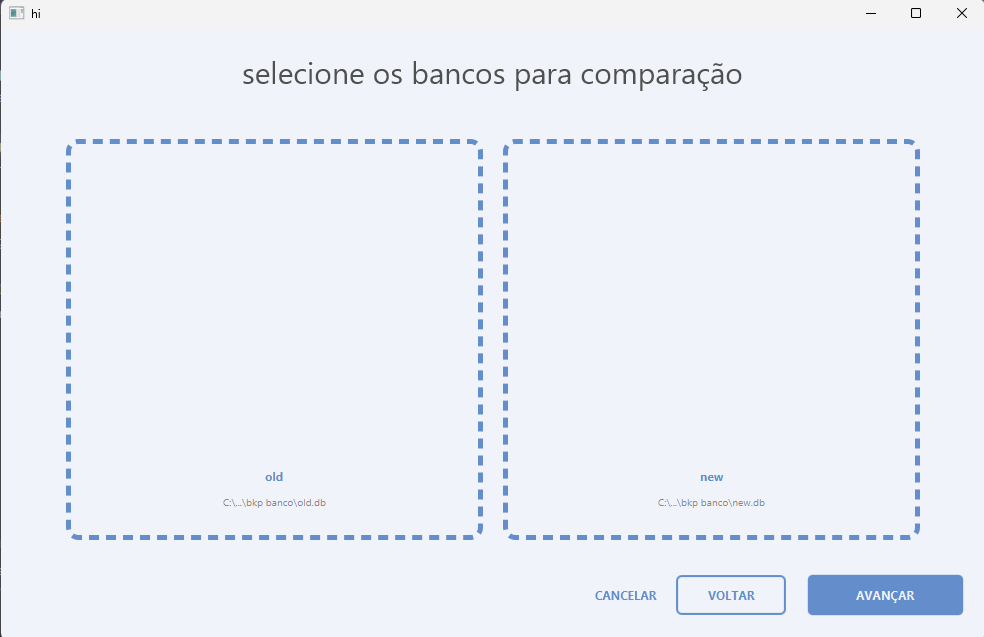
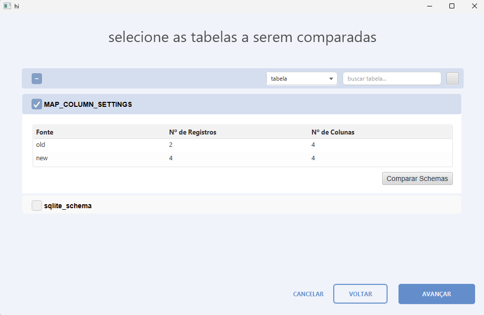
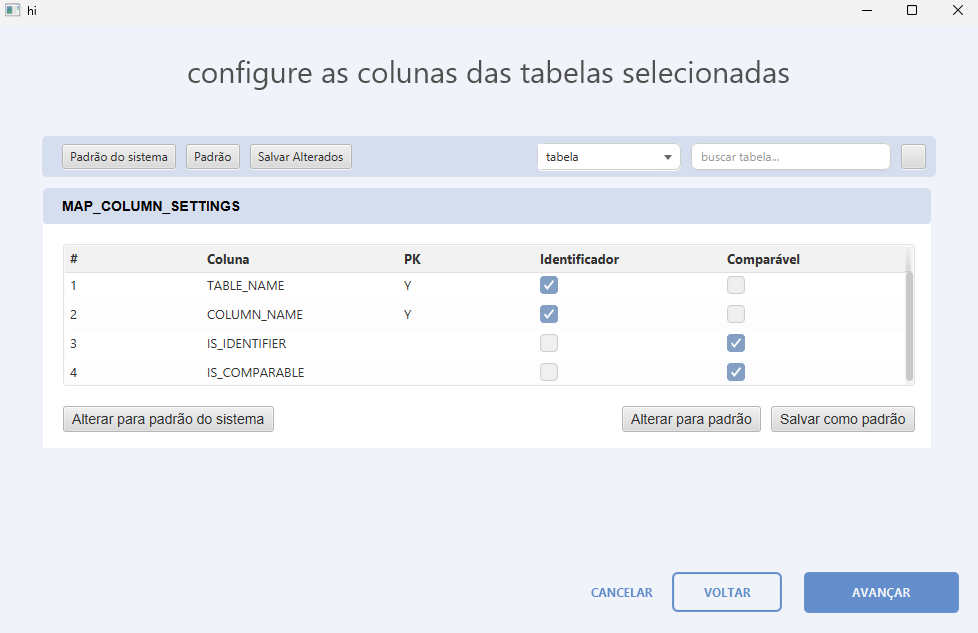
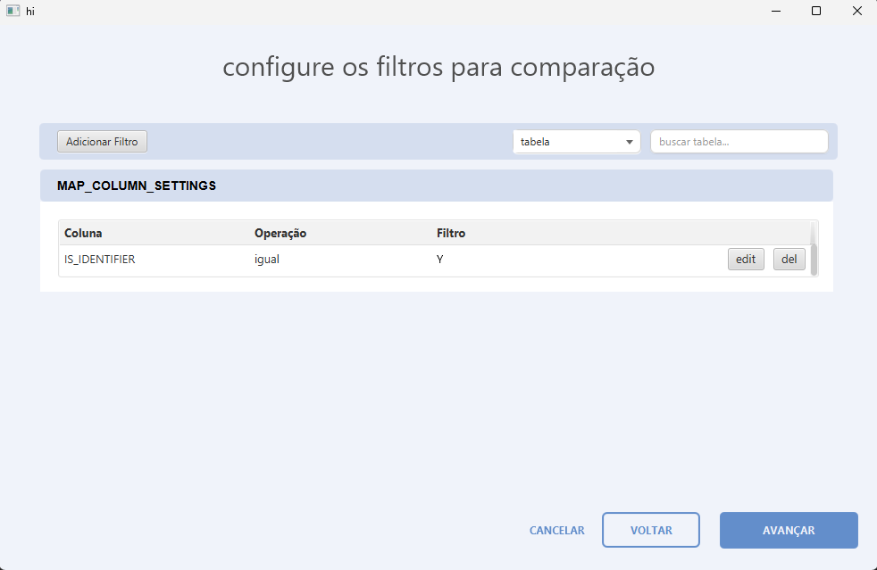
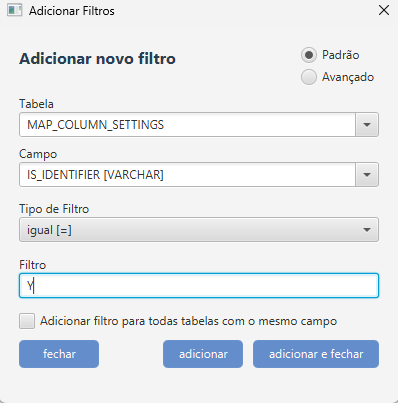
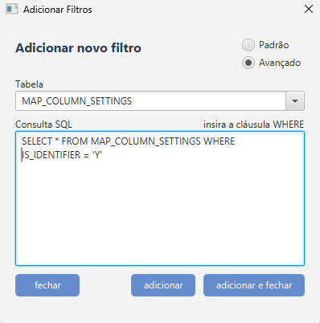
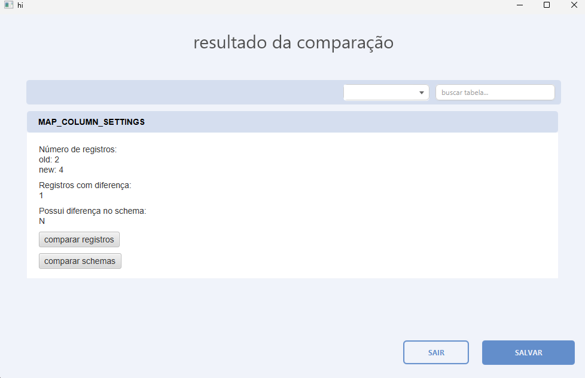
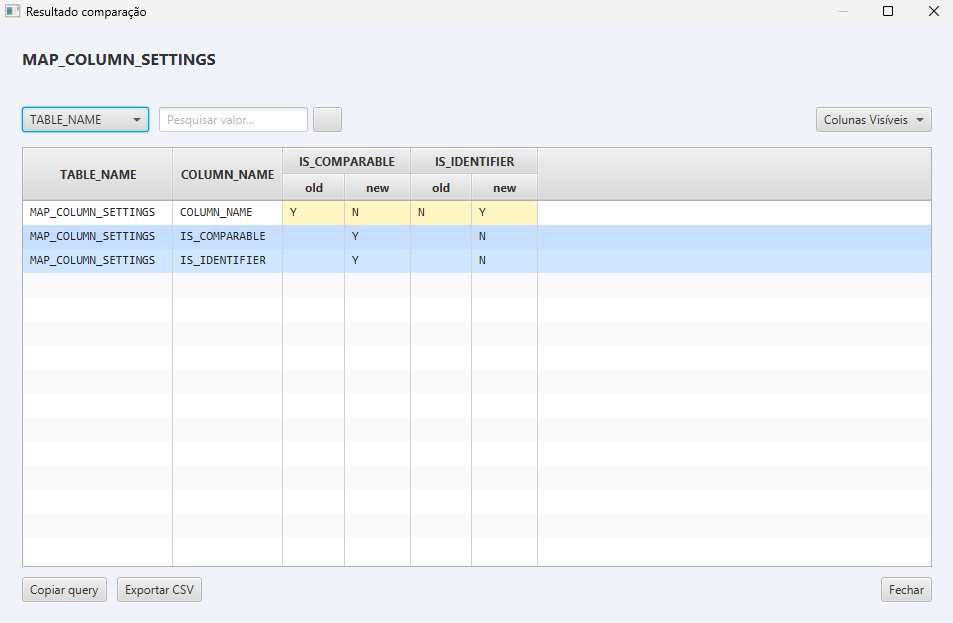

# 🛠️ DBComparator

> **Projeto em construção** 🚧  
> Sistema para auxiliar na **comparação de dados** e **schemas** de bancos **SQLite**.

---

## ✨ Funcionalidades
- 🔍 **Comparação de registros** — detecta diferenças entre dados de dois bancos SQLite.
- 📑 **Comparação de schemas** — identifica alterações na estrutura das tabelas.

---

## 🖥️ Tecnologias utilizadas
- **Java**
- **SQLite**

---

## 📸 Demonstração

| Tela                                                               | Descrição                                                                                                                                                                                     |
|--------------------------------------------------------------------|-----------------------------------------------------------------------------------------------------------------------------------------------------------------------------------------------|
|                   | Tela inicial, onde é possível anexar 2 bancos SQLite                                                                                                                                          |
|           | Tela onde o usuário seleciona as tabelas a serem comparadas.                                                                                                                                  |
|           | Tela onde o usuário configura quais campos são identificadores (utilizados pra encontrar registros iguais nos dois bancos) ou compáraveis (utilizados pra encontrar diferença)                |
|            | Tela onde o usuário pode configurar filtros para comparação (apenas registros que atendam os filtros serão comparados)                                                                        |
|      | Modo de adicionar filtro padrão - cada filtro é por coluna e é criado com auxílio do sistema.                                                                                                 |
|    | Modo de adicionar filtro avançado - um filtro por tabela. Usuário pode escrever a condição conforme desejar.                                                                                  |
|         | Tela final, onde o usuário pode ver algumas informações do resultado da comparação e realmente comparar ao clicar em "comparar registros".                                                    |
|  | Tela de comparação de registros, onde são apresentadas as diferenças. Em amarelo são as colunas que são diferente entre os bancos. Em azul são os registros que não existem em um dos bancos. |

---

---

## 🚀 Como executar (em breve)
> Esta seção será atualizada com o passo a passo para rodar o projeto localmente.

---

## 📌 Status do projeto
🚧 **Em desenvolvimento** — novas funcionalidades e melhorias estão sendo implementadas.
